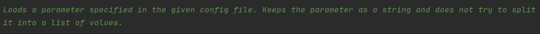
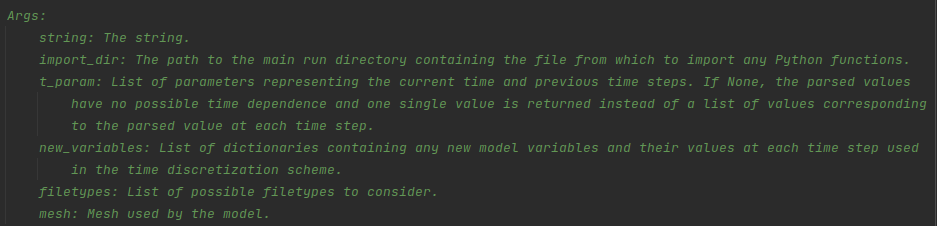
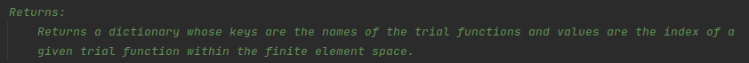
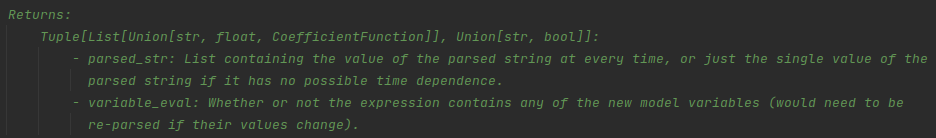

.. Some tips for formatting docstrings.
.. _writing_documentation:

Formatting Docstrings
=====================

To specify that a function returns multiple values do the following within the docstring:

.. image:: ../_static/docstring_multiple_returns.png
    :width: 600px
    :align: center
    :alt: Example docstring for a function that returns multiple values.
    
Normal reStructuredText blocks can be used within docstrings:

.. image:: ../_static/docstring_main_block_formatting.png
    :width: 600px
    :align: center
    :alt: Example docstring for a function with fancy whitespace formatting within the main docstring block.
    
Multi-line descriptions must be formatted differently depending on where they lie in the docstring. 
In the main block, each subsequent line should remain flush with the first line:

    
In the arguments, each subsequent line should be indented a few spaces (or a tab) from the first line:

    
In the returns, each subsequent line should remain flush with the text of the first line (not the hyphen in the case of multiple return values):

    

