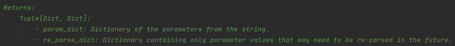
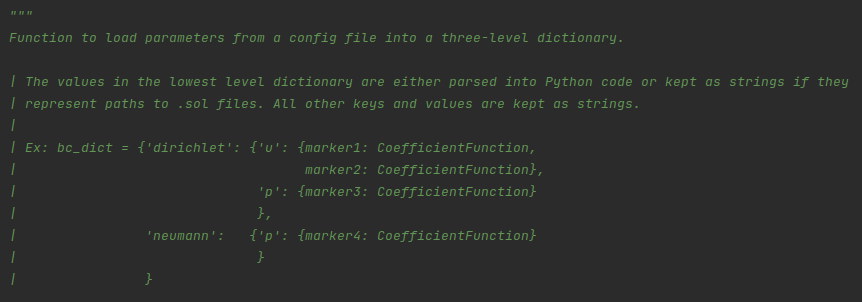

.. Some tips for formatting docstrings.
.. _writing_documentation:

Formatting Docstrings
=====================

To specify that a function returns multiple values do the following within the docstring:

    
To force line breaks or other formatting within the main docstring block do the following:

