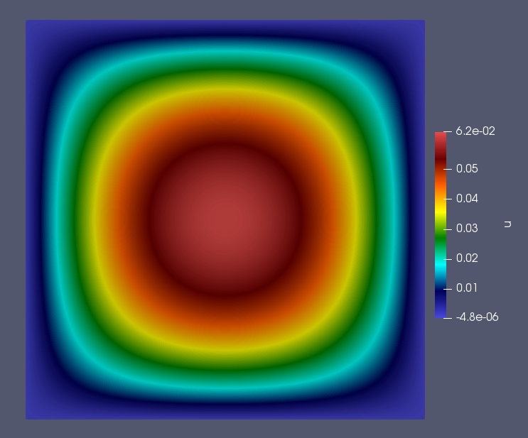

.. Contains the second tutorial.
.. _tutorial_2:

Tutorial 2 - Solving the Poisson Equation
=========================================

The files for this tutorial can be found in "Examples/tutorial_2".

Governing Equations
-------------------

This tutorial will demonstrate how to solve the Poisson equation with mixed Dirichlet and Neumann boundary conditions. Consider a domain :math:`\Omega` with boundary regions :math:`\Gamma_D` and :math:`\Gamma_N` corresponding to the Dirichlet and Neumann boundary conditions respectively. The governing equations are as follows:

.. math::
   -\nabla^2 u &= f \mbox{ in } \Omega \\
   u &= g \mbox{ on } \Gamma_D \\
   -\bm{n} \cdot \bm{\nabla} u &= h \mbox{ on } \Gamma_N

Choose the solution to be :math:`u = x(1-x)y(1-y)` and define the top and bottom boundaries to be :math:`\Gamma_D` and the right and left boundaries to be :math:`\Gamma_N`. Then, on a unit square domain, the governing equations become:

.. math::
   -\nabla^2 u &= 2\left(x(1-x) + y(1-y)\right) \mbox{ in } \Omega \\
   u &= 0 \mbox{ on the top/bottom} \\
   -\bm{n} \cdot \bm{\nabla} u &= \pm (1-2x)y(1-y) \mbox{ on the right/left}

These governing equations and the simulation parameters can now be specified in the configuration files.

The Main Configuration File
---------------------------

Start with the configuration file "config" in the main simulation directory.

The first section specifies the mesh information. All meshes used in the tutorials and examples can be found in the "mesh_files" directory. In this case, a unit square domain with four labelled boundaries is desired, so "unit_square_4bcs.vol" is used. The configuration file gives the path to this mesh file relative to the project. ::

   [MESH]
   filename = unit_square_4bcs.vol

The next section specifies the finite element space. As some models use different finite elements for each model variable a finite element must be specified for each model variable. In this case, the Poisson equation only has one model variable - "u" - and H1 elements will be used. An interpolant order of 2 is used, which should allow the governing equations to be solved exactly. ::

   [FINITE ELEMENT SPACE]
   elements = u -> H1
   interpolant_order = 2

Next the solver is specified. Since the mesh is quite small a direct solver can be used and no preconditioner is necessary. For a full list of the solvers and preconditioners available see :ref:`example_config`. ::

   [SOLVER]
   solver = direct
   preconditioner = None

The next section specifies if and how the simulation results should be saved to file. If "save_to_file" is set to "True" results are automatically saved to the Netgen .sol format. In this case, "save_type" is specified as ".vtu" so the results will also be saved to a .vtu file to be visualized in ParaView. ::

   [VISUALIZATION]
   save_to_file = True
   save_type = .vtu

Finally, the general run options must be specified. The model to be run is the Poisson equation and "run_dir" points to the main simulation directory so OpenCMP can find all the necessary configuration files. The final commonly specified parameter is "num_threads", which sets how many threads should be used for multithreading. This tutorial uses 2 threads by default. ::

   [OTHER]
   model = Poisson
   run_dir = .
   num_threads = 2

The Boundary Condition Configuration File
-----------------------------------------

The boundary conditions are specified in the "config" file inside the "bc_dir" subdirectory.

The Poisson equation has three possible types of boundary condition: Dirichlet boundary conditions, Neumann boundary conditions, and Robin boundary conditions. However, in this tutorial only Dirichlet and Neumann boundary conditions will be used. Each boundary condition type has its own section and boundary conditions must be specified by the model variable they apply to and the mesh boundary region they should be applied on.

The Poisson equation only has one single model variable - "u" - so all boundary conditions will be specified for "u". The Dirichlet boundary conditions will be applied to the top and bottom sides of the unit square and are identically zero. ::

   [DIRICHLET]
   u = top    -> 0
       bottom -> 0

The Neumann boundary conditions will be applied to the right and left sides of the unit square. ::

   [NEUMANN]
   u = right -> (1-2*x)*y*(1-y)
       left  -> -(1-2*x)*y*(1-y)

Note that the mesh file used for this tutorial has boundary markers "top", "bottom", "right", and "left". If the boundary markers changed the boundary condition configuration file would need to change to reflect the new marker names.

The Initial Condition Configuration File
----------------------------------------

Since this is a steady-state problem no initial condition is needed. The initial condition configuration file will be discussed in more detail in :ref:`tutorial_5`.

The Model Configuration File
----------------------------

Model parameter and function values are specified in the "config" file inside the "model_dir" subdirectory.

Model parameters and model functions are specified either for their specific model variable or for "all" if they affect all model variables. The Poisson equation has one model parameter - the diffusion coefficient - and one source function, both of which apply to all model variables. In the governing equations given above the diffusion coefficient is lumped into the source function, so it will just be set to one. ::

   [PARAMETERS]
   diffusion_coefficient = all -> 1.0

   [FUNCTIONS]
   source = all -> 2*(x*(1-x) + y*(1-y))

The Error Analysis Subdirectory
-------------------------------

Information about what error metrics to compute during post-processing is held in the "config" file in the "ref_sol_dir" subdirectory. However, no error analysis is done in this tutorial so that file can be kept blank.

Running the Simulation
----------------------

The simulation can be run from the command line; within the directory examples/tutorial_2/ execute :code:`python3 -m opencmp config`.

Several messages will print out to warn that default values are being used for some of the commonly specified configuration file parameters. A message will also print out at the end of the simulation when saved results are converted to .vtu files.

To visualize the simulation results go to the newly created "output" subdirectory and open "transient.pvd" in ParaView.

