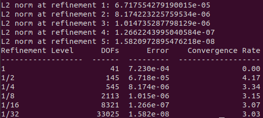

.. Contains the third tutorial.
.. _tutorial_3:

Tutorial 3 - Solving the Stokes Equations
=========================================

The files for this tutorial can be found in "examples/tutorial_3".

Governing Equations
-------------------

This tutorial will demonstrate how to solve the Stokes equations with Dirichlet and stress boundary conditions:

.. math::
   \bm{\nabla} p - \nu \nabla^2 \bm{u} &= \bm{f} \mbox{ in } \Omega \\
   \bm{\nabla} \cdot \bm{u} &= 0 \mbox{ in } \Omega \\
   \bm{u} &= \bm{g} \mbox{ on } \Gamma_D \\
   \bm{n} \cdot \left(p \mathbb{I} - \nu \bm{\nabla} \bm{u} \right) &= \bm{h} \mbox{ on } \Gamma_S

The specific example is flow through a pipe with a height of 0.2 and a length of 1. For a kinematic viscosity of 0.1 this has the exact solution:

.. math::
   \bm{u} &= 50 y (0.2 - y) \hat{x} \\
   p &= 10(1 - x)

There is a no-slip boundary condition at the walls of the pipe. At the inlet of the pipe a parabolic velocity profile is given and at the outlet there is a "do-nothing" stress boundary condition. Ignoring gravity the governing equations become as follows:

.. math::
   \bm{\nabla} p - 0.1 \nabla^2 \bm{u} &= \bm{0} \mbox{ in } \Omega \\
   \bm{\nabla} \cdot \bm{u} &= 0 \mbox{ in } \Omega \\
   \bm{u} &= \bm{0} \mbox{ on the walls} \\
   \bm{u} &= 50 y (0.2 - y) \hat{x} \mbox{ at the inlet} \\
   \bm{n} \cdot \left(p \mathbb{I} - 0.1 \bm{\nabla} \bm{u} \right) &= \bm{0} \mbox{ at the outlet}

The Main Configuration File
---------------------------

As usual the first section must be updated with the new mesh. ::

   [MESH]
   filename = channel_3bcs.vol

Stokes flow involves two model variables - "u" for velocity and "p" for pressure - which must be reflected in the finite element space. Velocity and pressure require different finite elements since velocity is a vector quantity and pressure is a scalar quantity. Furthermore, in this tutorial the HDiv-L2 combination will be used to strongly enforce the incompressibility constraint.

Only a single value is given for the interpolant order. However, to satisfy the inf-sup condition the pressure interpolant order will be one less than the velocity interpolant order. This is automatically taken care of by the model and the "interpolant_order" parameter can be thought of as the highest interpolant order present in the mixed finite element space. ::

   [FINITE ELEMENT SPACE]
   elements = u -> HDiv
              p -> L2
   interpolant_order = 3

The HDiv-L2 pair should only be used with a DG formulation, so a new section is added to specify the DG parameters. "interior_penalty_coefficient" sets the value of the penalty coefficient in the Interior Penalty Discontinuous Galerkin method and should typically have a value of 6-10. ::

   [DG]
   DG = True
   interior_penalty_coefficient = 10.0

A new solver and preconditioner will be used to demonstrate OpenCMP's functionality. The solver's residual error tolerance and maximum number of iterations are both specified, but it's generally reasonable to leave the default values. ::

   [SOLVER]
   solver = CG
   preconditioner = direct
   solver_tolerance = 1e-12
   solver_max_iterations = 100

A full error analysis will be performed on the final simulation results. Most of the error analysis parameters are specified in the error analysis configuration file, but "check_error" must be set to "True" for the error metrics to be computed. ::

   [ERROR ANALYSIS]
   check_error = True

The correct model must also be specified. ::

   [OTHER]
   model = Stokes
   run_dir = .
   num_threads = 2

The Boundary Condition Configuration File
-----------------------------------------

The Stokes equation has different types of possible boundary conditions than the Poisson equation, but they are specified in a similar manner. For this problem, the mesh has boundary markers "inlet", "wall", and "outlet. The first two boundaries have Dirichlet velocity boundary conditions: ::

   [DIRICHLET]
   u = inlet -> [50*y*(0.2-y), 0.0]
       wall  -> [0.0, 0.0]

The stress boundary condition follows the same syntax. ::

   [STRESS]
   u = outlet -> [0.0, 0.0]

Note that all of the boundary conditions are vectors, which are denoted by square brackets. For more information about configuration file syntax see :ref:`syntax`.

The Model Configuration File
----------------------------

Instead of a diffusion coefficient, the Stokes equation has a kinematic viscosity. Additionally, the source function is now a vector. ::

   [PARAMETERS]
   kinematic_viscosity = all -> 0.1

   [FUNCTIONS]
   source = all -> [0.0, 0.0]

The Error Analysis Subdirectory
-------------------------------

Similar to :ref:`tutorial_3`, a reference solution must be given for error to be computed against. However, now it must be specified for both model variables. ::

   [REFERENCE SOLUTIONS]
   u = -> [50*y*(0.2-y), 0.0]
   p = 10*(1-x)

In this tutorial, all of the possible error metrics will be computed. These are specified by listing the name of the error metric and giving the model variables for which it should be computed. ::

   [METRICS]
   L2_norm = u, p
   L1_norm = u, p
   Linfinity_norm = u, p
   divergence = u
   facet_jumps = u, p

Most error metrics, like the L2 norm, can be computed for both model variables. However, it only makes sense to compute the divergence for velocity. If the incompressibility constraint is satisfied :math:`\bm{\nabla} \cdot \bm{u} \approx 0`, but the divergence of pressure has no significance.

"facet_jumps" measures the magnitude of the discontinuities in the final solution and is only significant when DG is used. It can be computed when DG is not used but will always be zero.

Running the Simulation
----------------------

The simulation can be run from the command line; within the directory "examples/tutorial_3/" execute :code:`python3 -m opencmp config`.

Once the simulation has finished the values of the error metrics will be printed out.

The results match the known exact solution well, the incompressibility constraint is well satisfied, and the final velocity and pressure fields are more-or-less continuous as expected.
