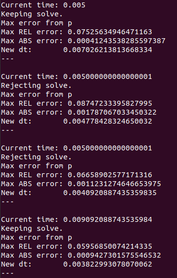
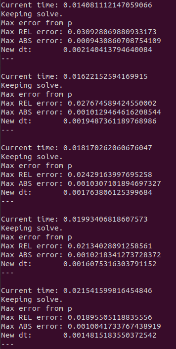
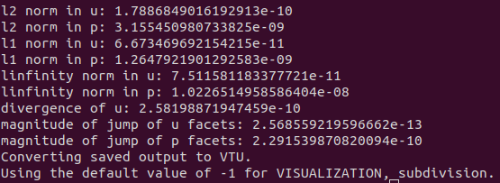

.. Contains the sixth tutorial.
.. _tutorial_6:

Tutorial 6 - Adaptive Time-Stepping
===================================

The files for this tutorial can be found in "examples/tutorial_6".

Governing Equations
-------------------

This tutorial will demonstrate how to solve the transient Stokes equation using an adaptive time-stepping scheme. The governing equations are the same as those used in :ref:`tutorial_5`.

The Main Configuration File
---------------------------

The only changes are to the transient solve section. The time discretization scheme must be changed to one of the adaptive time-stepping schemes and additional parameters must be specified to control the changes in time step.

In this tutorial, the adaptive two step scheme will be used. This is a first order time discretization scheme formed from a combination of implicit Euler and Crank-Nicolson. For a full list of the available time discretization schemes see :ref:`example_config`.

"dt" now specifies the initial time step and "dt_range" controls the minimum and maximum allowed time step. "dt_tolerance" sets the local error tolerance at each time step. A relative tolerance must be given and an absolute tolerance is optional. At each time step the local error will be estimated and the time step will only be accepted if the local error meets the specified tolerance. If the local error exceeds the tolerance the time step will be repeated with a smaller dt. ::

   [TRANSIENT]
   transient = True
   scheme = implicit euler
   time_range = 0, 2
   dt = 0.005
   dt_range = 1e-10, 0.1
   dt_tolerance = relative -> 1e-3
                  absolute -> 1e-3

Running the Simulation
----------------------

The simulation can be run from the command line; within the directory "examples/tutorial_6/" execute :code:`python3 -m opencmp config`.

After each time step a print out gives the current time, whether or not the time step was accepted, estimates of the maximum local error at the time step, and the size of the next time step.

The first several time steps flip back and forth between accepting (or keeping) and rejecting the time step.

After ~0.015s a reasonable time step size has been found and all subsequent time steps are accepted. However, the time step size continues to slowly decrease as the local error in the pressure is still very close to the specified tolerance.

By ~0.5s the inlet ramp has finished and the time step size can rapidly increase.

.. image:: ../_static/tutorial_6_c.png
   :width: 225
   :align: center
   :alt: Time step progression after dynamics have ended.

The error metrics for the final solution again match the known exact solution well.

