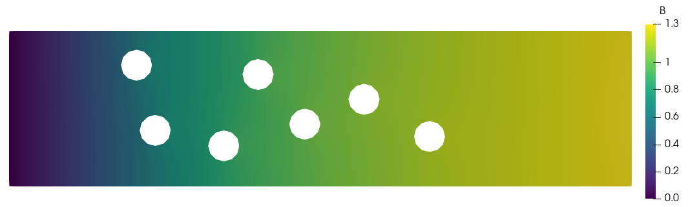
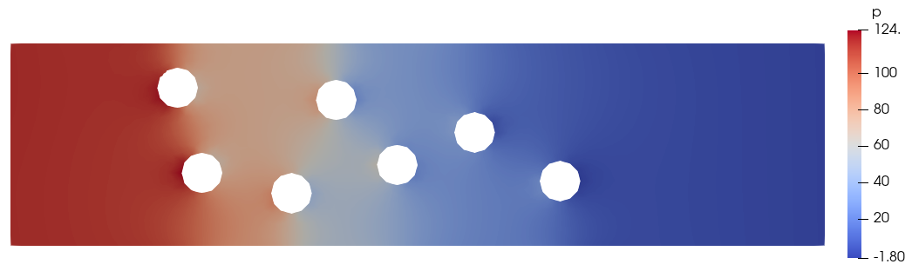

.. Contains the eighth tutorial.
.. _tutorial_8:

Tutorial 8 - Multi-Component Flow
=================================

The files for this tutorial can be found in "examples/tutorial_8".

Governing Equations
-------------------

This tutorial will demonstrate how to add convection, diffusion, and reaction of multiple dissolved components to incompressible Navier-Stokes flow. The test case will be a channel containing multiple circular catalyst particles at whose surface component A undergoes a first-order irreversible reaction to transform into component B. The reaction and transport of components A and B are modelled by the following equations:

.. math::
   \frac{\partial c_A}{\partial t} + \bm{\nabla} \cdot \left( \bm{u} c_A \right) - \mathcal{D}_A \nabla^2 c_A &= -c_A \mbox{ in } \Omega \\
   \frac{\partial c_B}{\partial t} + \bm{\nabla} \cdot \left( \bm{u} c_B \right) - \mathcal{D}_B \nabla^2 c_B &= c_A \mbox{ in } \Omega \\
   c_A(t=0) &= 0 \mbox{ in } \Omega \\
   c_B(t=0) &= 0 \mbox{ in } \Omega \\
   c_A &= 1 \mbox{ at inlet} \\
   c_B &= 0 \mbox{ at inlet} \\
   -\bm{n} \cdot \bm{\nabla} c_A = -\bm{n} \cdot \bm{\nabla} c_B &= 0 \mbox{ at walls} \\
   \left( \bm{n} \cdot \bm{u} \right) c_A - \mathcal{D}_A \bm{n} \cdot \bm{\nabla} c_A - \max \left( \bm{n} \cdot \bm{u}, 0 \right) c_A &= 0 \mbox{ at outlet} \\
   \left( \bm{n} \cdot \bm{u} \right) c_B - \mathcal{D}_B \bm{n} \cdot \bm{\nabla} c_B - \max \left( \bm{n} \cdot \bm{u}, 0 \right) c_B &= 0 \mbox{ at outlet}

The velocity profile comes from the solution of the incompressible Navier-Stokes equations, given below with Oseen-style linearization:

.. math::
   \frac{\partial \bm{u}}{\partial t} + \bm{\nabla} \cdot \left( \bm{u} \bm{w} \right) - \nu \nabla^2 \bm{u} + \bm{\nabla} p &= \bm{f} \mbox{ in } \Omega \\
   \bm{\nabla} \cdot \bm{u} &= 0 \mbox{ in } \Omega \\
   \bm{u}(t=0) &= \bm{0} \mbox{ in } \Omega \\
   p(t=0) &= 0 \mbox{ in } \Omega \\
   \bm{u} &= 4y \left( 0.5 - y \right) \bm{\delta}_x \mbox{ at inlet} \\
   \bm{u} &= \bm{0} \mbox{ on walls} \\
   \bm{n} \cdot \left(\bm{u} \bm{w} - \nu \bm{\nabla} \bm{u} + p \mathbb{I} \right) - \max (\bm{n} \cdot \bm{w}, 0) \bm{u} &= \bm{0} \mbox{ at outlet}

with a kinematic viscosity of 0.001.

The Main Configuration Files
----------------------------

The main configuration file is very similar to that used in :ref:`tutorial_7`.

One major change is the addition of finite element spaces for components A and B. Note that the discontinuous Galerkin method is not used as it is not yet fully implemented for multi-component flows. Instead, the Taylor-Hood finite element pair is used for velocity and pressure and the additional components use the same scalar finite elements as the pressure field. ::

   [FINITE ELEMENT SPACE]
   elements = u -> VectorH1
              p -> H1
              a -> H1
              b -> H1
   interpolant_order = 3

   [DG]
   DG = False

The transient solve parameters should also be modified to increase the simulation duration and ensure a steady flow is eventually achieved. ::

   [TRANSIENT]
   transient = True
   scheme = implicit euler
   time_range = 0.0, 10.0
   dt = 1e-2

Finally, the model type must be changed to "MultiComponentINS" and the model must be given information about the additional components. The components must be named according to how they are referenced in the configuration files and it must be noted that the component results should be used in any error calculations and that the governing equations for both components include time derivative terms. ::

   [OTHER]
   model = MultiComponentINS
   component_names = a, b
   component_in_error_calc = a -> True
                             b -> True
   component_in_time_deriv = a -> True
                             b -> True
   run_dir = .
   num_threads = 2

The Boundary Condition Configuration File
-----------------------------------------

The boundary condition configuration file now must include boundary conditions for component transport and reaction in addition to the usual flow boundary conditions. ::

   [DIRICHLET]
   u = inlet  -> [y*(0.5-y)/0.5^2, 0.0]
       wall   -> [0.0, 0.0]
       circle -> [0.0, 0.0]
   a = inlet -> 1.0
   b = inlet -> 0.0

   [STRESS]
   stress = outlet -> [0.0, 0.0]

   [TOTAL_FLUX]
   a = outlet -> 0.0
       wall   -> 0.0
   b = outlet -> 0.0
       wall   -> 0.0

   [SURFACE_RXN]
   a = circle -> -a
   b = circle -> a

Note that the surfaces of the catalyst particles have been marked "circle" on the mesh.

The Initial Condition Configuration File
----------------------------------------

The initial conditions are simply zero throughout the domain. ::

   [MultiComponentINS]
   u = all -> [0.0, 0.0]
   p = all -> 0.0
   a = all -> 0.0
   b = all -> 0.0

The Model Configuration File
----------------------------

The model configuration file contains the usual model parameters and model functions for the flow distribution and now additional ones for component transport. ::

   [PARAMETERS]
   kinematic_viscosity = all -> 1
   diffusion_coefficients = a -> 1
                            b -> 1

   [FUNCTIONS]
   source = u -> [0.0, 0.0]
            a -> 0
            b -> 0

The Error Analysis Subdirectory
-------------------------------

In this case, the exact solution is not known, so the error analysis configuration file is left empty. Note that the divergence of the velocity and the velocity could be calculated -- it doesn't require a reference solution -- but aren't.

Running the Simulation
----------------------

The simulation can be run from the command line; within the directory "examples/tutorial_8/" execute :code:`python3 -m opencmp config`. 

As usual, the progress of the transient simulation can be tracked from the print outs at each time step. Once the simulation has finished the results can be visualized by opening "output/transient.pvd" in ParaView. Below is the distribution of components A and B after 10s:

.. image:: ../_static/tutorial_8_a.png
   :width: 600
   :align: center
   :alt: Steady-state distribution of component A.

and the velocity and pressure distributions:

.. image:: ../_static/tutorial_8_c.png
   :width: 600
   :align: center
   :alt: Steady-state velocity profile.

