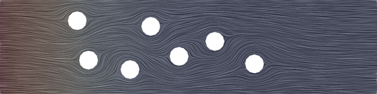
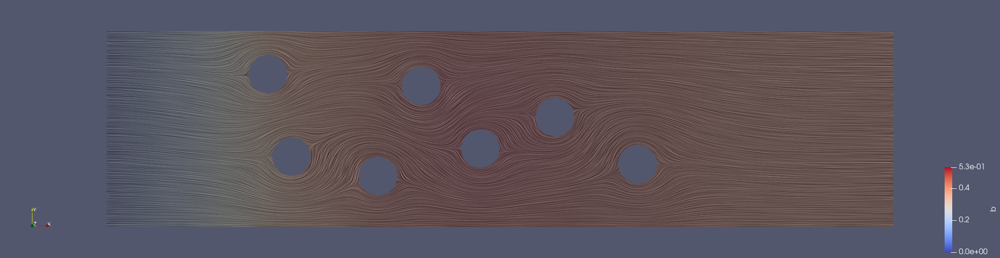
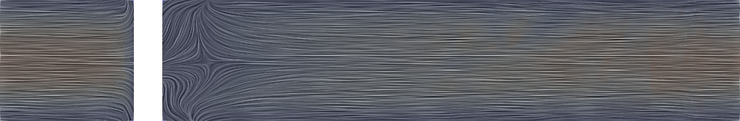
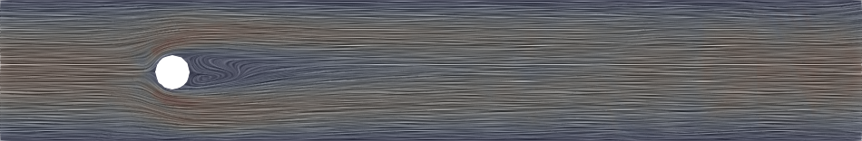
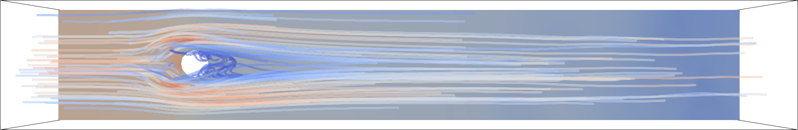

# Summary

OpenCMP is a computational multiphysics software package based on the finite element method [@Ferziger2002]. It is primarily intended for physicochemical processes in which fluid convection plays a significant role. OpenCMP uses the NGSolve finite element library [@ngsolve] for spatial discretization and provides a configuration file-based interface for pre-implemented models and time discretization schemes. It also integrates with Netgen [@ngsolve] and Gmsh [@Geuzaine2009] for geometry construction and meshing. Additionally, it provides users with built-in functionality for post-processing, error analysis, and data export for visualisation using Netgen [@ngsolve] or ParaView [@Ahrens2005].

OpenCMP development follows the principles of ease of use, performance, and extensibility. The configuration file-based user interface is intended to be concise, readable, and intuitive. Furthermore, the code base is structured and documented [@Monte2021a] such that experienced users with appropriate background can add their own models with minimal modifications to existing code. The finite element method enables the use of high-order polynomial interpolants for increased simulation accuracy, however, continuous finite element methods suffer from stability and accuracy (conservation) for fluid convection-dominated problems. OpenCMP addresses this by providing discontinuous Galerkin method [@Cockburn2000] solvers, which are locally conservative and improve simulation stability for convection-dominated problems. Finally, OpenCMP implements the diffuse interface or diffuse domain method [@Monte2021] [@Nguyen2018], which a type of continuous immersed boundary method [@Mittal2005]. This method enables complex domains to be meshed by non-conforming structured meshes for improved simulation stability and reduced computational complexity (under certain conditions [@Monte2021]).

# Statement of Need

Simulation-based analysis continues to revolutionize the engineering design process. Simulations offer a fast, inexpensive, and safe alternative to physical prototyping for preliminary design screening and optimization. Simulations can also offer more detailed insight into the physical phenomena of interest than is feasible from experimentation. Computational multiphysics is an area of particular importance since coupled physical and chemical processes are ubiquitous in science and engineering.

However, there are several barriers to more wide spread use of simulations. One such barrier is the lack of user-friendly finite element-based open-source simulation software. Many of the most widely-used computational multiphysics software packages, such as COMSOL Multiphysics [@comsol] or ANSYS Fluent [@fluent], are closed-source and cost-prohibitive. Furthermore, the predominance of the finite volume method for fluid dynamics simulations inherently limits simulation accuracy for a given mesh compared to the finite element method [@Ferziger2002]. Many high-quality open-source packages exist which use the finite element method, such as the computational multiphysics software MOOSE [@Permann2020], the finite element libraries NGSolve [@ngsolve] or FEniCS [@Alnaes2015]. However, these packages require that the user has a relatively detailed understanding of the finite element method, such as derivation of the weak formulation of the problem, along with programming experience. Alternatively, open-source finite volume-based packages such OpenFOAM[@OpenFOAM] and SU2 [@SU2] are more accessible to the broader scientific and engineering community in that they require a less detailed understanding of numerical methods and programming, instead requiring an understanding of the command line interface (CLI) and configuration through a set of configuration files.

A second barrier is the complex geometries inherent to many real-world problems. Conformal meshing of these complex geometries is time and labour intensive and frequently requires user-interaction, making conformal mesh-based simulations infeasible for high-throughput design screening of many industrially-relevant processes [@Yu2015]. A possible solution is the use of immersed boundary methods [@Mittal2005] to allow the use of non-conforming structured meshes - simple and fast to generate - for any geometry. Use of structured meshes can also potentially improve simulation stability compared to unstructured meshes [@Yu2015]. The diffuse interface has been shown by Monte *et al* [@Monte2021] to significantly speed-up inherently low accuracy simulations - such as those used for preliminary design screening and optimization - compared to conformal mesh-based simulations. Providing an easy-to-use publicly available implementation of this method would enable broader use by the research community and further development.

The goal of OpenCMP is to fill this evident need for an open-source computational multiphysics package which is user-friendly, based on the finite element method, and which implements the diffuse interface method. OpenCMP is built on top of the NGSolve finite element library [@ngsolve] to take advantage of its extensive finite element spaces, high performance solvers, and preconditioners. OpenCMP provides pre-implemented models and a configuration file-based user interface in order to be accessible to the general simulation community, not just finite element experts. The user interface is designed to be intuitive, readable, and requires no programming experience - solely knowledge of the CLI. Users must choose the model that suites their application, but need no experience with the actual numerical implementation of said model. Finally, OpenCMP provides a publicly available implementation of the diffuse interface method with support for stabilized Dirichlet boundary conditions [@Nguyen2018].

# Features

The table below summarizes the current capabilities of OpenCMP. The numerical solvers for each of these models have been verified using common benchmarks [@Monte2021a]. Future work on OpenCMP will focus on adding models - for multi-phase flow, turbulence, and heat transfer - and enabling running simulations in parallel over multiple nodes with MPI [@mpi].

| Feature           | Description                                                  |
| ----------------- | ------------------------------------------------------------ |
| Meshing           | Accepts Netgen [@ngsolve] or Gmsh [@Geuzaine2009] meshes     |
| Numerical Methods | Standard continuous Galerkin finite element method           |
|                   | Discontinuous Galerkin finite element method                 |
|                   | Diffuse interface method                                     |
| Models            | Poisson (Heat) equation      |
|                   | Stokes equations                                             |
|                   | Incompressible Navier-Stokes (INS) equations                 |
|                   | Multicomponent Mixture INS equations                         |
| Time Schemes      | First-, second-, and third- order discretizations            |
|                   | Adaptive time-stepping                                       |
| Solvers           | Direct or iterative solvers                                  |
|                   | Direct, Jacobi, or multigrid preconditioners                 |
|                   | Oseen [@Cockburn2003] or IMEX [@Ascher1995] linearization of nonlinear models |
| Post-Processing   | Error norms calculated based on reference solutions          |
|                   | Mesh and polynomial refinement convergence tests             |
|                   | General simulation parameters (surface traction, divergence of velocity...) |
|                   | Exports results to Netgen [@ngsolve] or ParaView [@Ahrens2005] format |
| Performance       | Multi-threading                                              |

Further information, including [installation instructions](https://opencmp.io/getting_started/installation_guide.html) and [tutorials](https://opencmp.io/tutorials/index.html) can be found on the OpenCMP [website](https://opencmp.io/). The tutorials are intended to guide new users through the various features offered in OpenCMP. Notes on the [mathematical foundations](https://opencmp.io/mathematical_notes/index.html) of the various models and [code documentation](https://opencmp.io/source/modules.html) are also provided.

Software testing is provided through integration tests, which confirm the accuracy of the implemented models and time discretization schemes, and unit tests which currently offer 72% line coverage. Further information regarding performance verification of OpenCMP may be found in ref. [@Monte2021a].

# User Interface

Drawing inspiration from packages like [OpenFOAM](https://openfoam.org/) and [SU2](https://su2code.github.io/), the OpenCMP user  interface is organized around configuration files and the CLI. Each simulation requires its own directory to hold its configuration  files and outputs. This is known as the run directory or `run_dir/`. The standard layout of this directory is shown below.

The main directory and each subdirectory contain a configuration file  (*e.g.* `bc_config`). These are plaintext files that specify the  simulation parameters and run conditions.

The configuration file in the main directory contains general information about the simulation including which model, mesh, finite  element spaces, and solver should be used. It also contains information about how the simulation should be executed such as the level of detail in the output messages and the number of threads to use.

The `bc_dir/` subdirectory contains information about the boundary conditions. Its configuration file specifies the type and value of each  boundary condition. This subdirectory also contains files describing boundary condition data if a boundary condition value is to be loaded  from file instead of given in closed form.

The `ic_dir` subdirectory holds information about the initial  conditions. Its configuration file specifies the value of the initial condition for each model variable. Like `bc_dir/`, `ic_dir/` may contain  additional files from which the initial condition data is loaded during  the simulation.

The `model_dir/` subdirectory contains information about model parameters and model functions. Its configuration file specifies the values of any model parameters or functions for each model variable and the  subdirectory may hold additional data files to be loaded during the  simulation.

The `ref_sol_dir/` subdirectory contains information about the error analysis to be conducted on the final simulation result. Its configuration file specifies what error metrics should be computed during post-processing. This configuration file also contains the  reference solutions the results should be compared against, either in closed form or as references to other files in the subdirectory that are loaded during post-processing.

The `output/` subdirectory contains the saved simulation data. It does not need to be created before running the simulation, it will be generated automatically if results should be saved to file.

# Examples of Usage

Several examples of usage of OpenCMP are present in ref. [@Monte2021a] and also available via the its [website](https://opencmp.io/tutorials/). Three relevant examples are summarized here: multi-component incompressible flow (transient 2D, [Tutorial 8](https://opencmp.io/tutorials/tutorial_8.html)), using the diffuse interface method to approximate complex geometries (steady-state 3D, [Tutorial 9](https://opencmp.io/tutorials/tutorial_9.html)), and incompressible flow around an immersed cylinder (steady-state 3D, [Tutorial 10](https://opencmp.io/tutorials/tutorial_10.html)).

[Tutorial 8](https://opencmp.io/tutorials/tutorial_8.html) demonstrates the usage of OpenCMP to solve a multiphysics problem, two-dimensional transient multi-component incompressible flow around a set of immersed circular objects within a rectangular channel, shown below.

The mixture is composed of two components (A, B) where A undergoes an irreversible reaction A &#8594; B. A parabolic inlet flow of pure A is imposed, such that the mixture undergoes convection, reaction, and molecular diffusion throughout the channel. Sample simulation results of the steady-state are shown resulting from a cosine ramp of the inlet velocity an initial condition with no flow and pure A.

[Tutorial 9](https://opencmp.io/tutorials/tutorial_9.html) demonstrates how to use the diffuse interface method to approximate complex geometries with nonconformal structured quadrilateral/hexahedral meshes, versus the use of a traditional unstructured mesh which conforms to the complex geometry boundary. The sample problem is based on simulation of heat transfer within an LED heat sink from ref. [@Monte2021], with a geometry shown below.

The base of the heat sink is exposed to a spatially varying heat flux profile, corresponding to heat generated by an LED assembly, with convective heat transfer conditions assumed on the exterior fins. A script is provided for ease of post-processing visualization, showing the diffuse-interface boundaries (comparable to the geometry above) and steady-state temperature profile.

[Tutorial 10](https://opencmp.io/tutorials/tutorial_10.html) demonstrate using OpenCMP to perform a standard benchmark for 3D flow around an immersed cylinder [@Bayraktar2012] under laminar flow conditions. Both continuous and discontinuous Galerkin finite element solver configurations are provided, defaulting to the continuous Galerkin variation due to reduced memory constraints. The geometry involves an immersed cylinder in square channel with parabolic inlet velocity resulting in Re=20. This example also uses the built-in error analysis functionality of OpenCMP to automatically compute the force vector on the immersed cylinder through integration of the surface traction over its boundary. This facilitates the calculation of the resulting drag and lift forces on the immersed cylinder.

Visualizations of the three-dimensional steady-state velocity field are shown below and include side and top view cross-sections with line integral convolution rendering of the velocity field. Additionally, velocity streamlines are shown with a background cross-section indicating pressure along the channel.

Several additional examples of usage of OpenCMP in tutorial form are available via the [website](https://opencmp.io/tutorials/).

# Acknowledgements

The authors would like to thank Prof. Sander Rhebergen for useful discussions regarding the discontinuous Galerkin method and Prof. Joachim Schöberl for useful discussions regarding IMEX time integration, preconditioning, and usage of the NGSolve finite element library. This research was supported by the Natural Sciences and Engineering Research Council (NSERC) of Canada and Compute Canada.

# References
